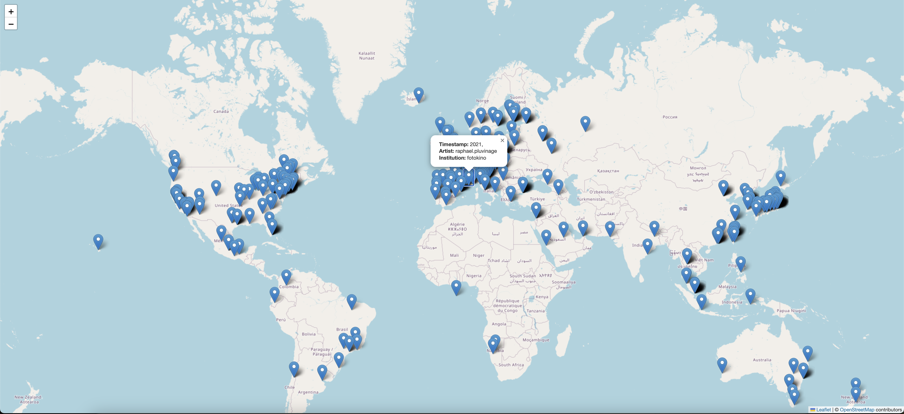

# ac-map
**awecuration.com open geographic database**

This is the geographic database which visualises locations of technology art studios and their exhibitions as [@awe.curation](https://www.instagram.com/awe.curation/) promoted them. This repository contains the tools and data used to create this interactive map, showcasing the global footprint of technology art curated on our Instagram account. Each location is tagged with the time period of the exhibition, providing a historical context for the spread and influence of technology art.

## Features

- **Interactive Map**: Explore an interactive map displaying the geolocations of tech art studios and their exhibitions.
- **Time Filter**: View exhibitions based on specific time periods.
- **Detailed Information**: Access detailed information about each exhibition, including studio details and exhibition dates.
- **Data Integration**: Data extracted from years of geo-tagged Instagram posts.

## Getting Started

### Prerequisites

- Python 3.8+
- [TBC]

### Installation

1. Clone the repository:

    ```bash
    git clone https://github.com/nyl-dev/ac-map.git
    cd ac-map

2. Install the required dependencies:

    ```bash
    pip install -r requirements.txt
    ```

## Usage

1. **Add Your Data**: Add your studio data to the provided `output.json` file in the `data` directory. Ensure the data includes the necessary fields such as studio name, location, and exhibition dates.
2. **Run the Local Server**: Start a local server to view the map:

    ```bash
    python3 server.py
    ```

3. **View the Map**: Open your web browser and go to [http://localhost:8000/](http://localhost:8000/) to interact with the pre-generated map.

### Example



## Contributing

We welcome contributions from the community! Please read our [contributing guidelines](CONTRIBUTING.md) before submitting a pull request.

## License

This project is licensed under the Creative Commons Attribution-NonCommercial 4.0 International License - see the [LICENSE](LICENSE) file for details.

## Hosting

The interactive map will soon be hosted on [awecuration.com](https://awecuration.com). Visit the site to explore the live map with the latest updates.

## Contact

For any questions or suggestions, feel free to open an issue or contact us at awe.curation@gmail.com


